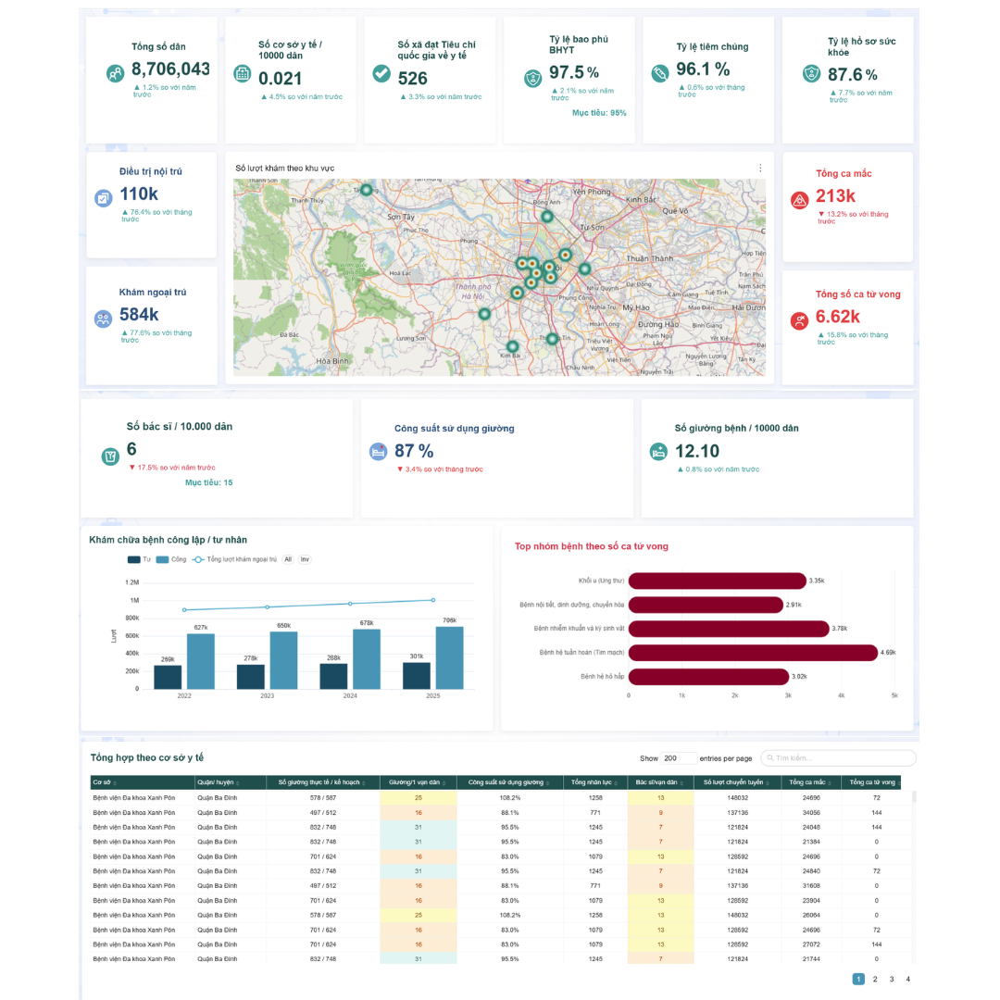
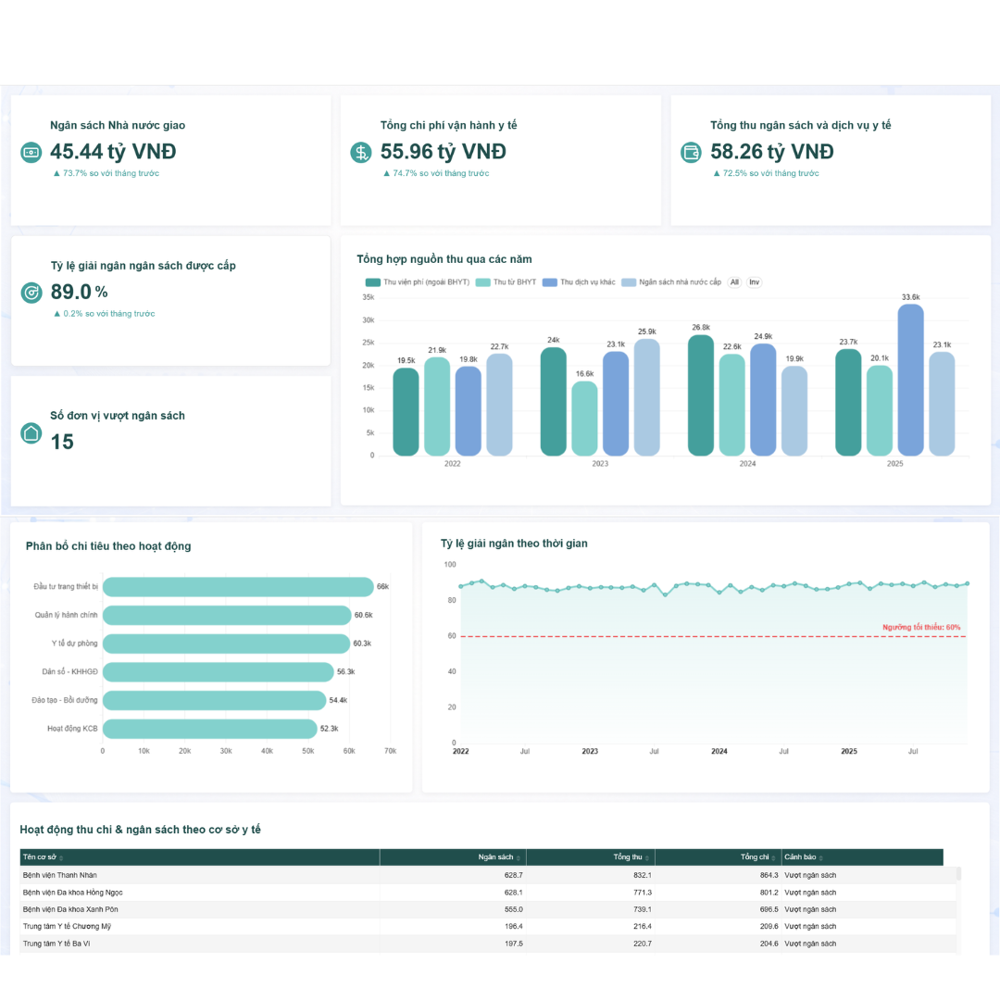
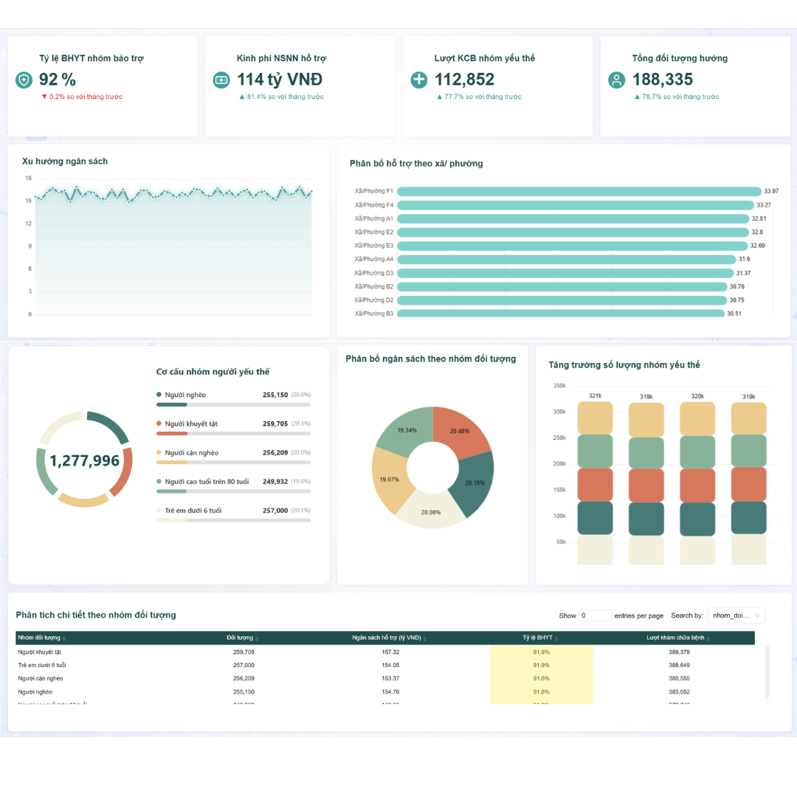

# Healthcare BI Dashboard

## Overview

Designed and developed interactive BI dashboards using simulated
healthcare data modeled around provincial Department of Health workflows.

The objective was to transform operational data into management-oriented
dashboards that allow users to move from high-level KPIs to detailed
operational information.

## Dashboard Structure

### 01 — Healthcare Overview

The overview dashboard provides a high-level view of healthcare
operations, including:

- Population
- Healthcare facility coverage
- Health insurance coverage
- Vaccination coverage
- Electronic health record coverage
- Inpatient visits
- Outpatient visits
- Disease statistics
- Healthcare workforce
- Bed utilization

The dashboard combines KPI cards, geographic visualization,
trend analysis, rankings, and detailed tables.

---

### 02 — Healthcare Finance & Budget

The finance dashboard focuses on:

- State budget allocation
- Healthcare operating expenditure
- Healthcare revenue
- Budget disbursement
- Revenue sources
- Expenditure by activity
- Budget trends
- Healthcare facility-level expenditure

---

### 03 — Vulnerable Population & Social Support

The dashboard focuses on:

- Supported health insurance coverage
- State budget support
- Healthcare visits among vulnerable groups
- Supported population
- Population distribution by vulnerable group
- Budget allocation by population group
- Distribution by commune/ward

---

## Visualization

The dashboards use multiple visualization types:

- KPI cards
- Bar charts
- Line charts
- Progress / threshold charts
- Pie / donut charts
- Maps
- Detail tables

The dashboard structure follows an overview-to-detail approach,
allowing users to identify important indicators first and then
explore supporting breakdowns.

## Technology

- Apache Superset
- SQL
- Data Warehouse / Data Mart
- BI Dashboard Design

## My Contribution

- Analyzed healthcare reporting requirements and simulated data
- Defined and organized dashboard indicators
- Built dashboard views and SQL-based visualizations
- Customized chart configurations
- Tested dashboard behavior and data presentation
- Collaborated with developers on BI visualization requirements

## Key Takeaways

This work strengthened my experience in:

- Translating business requirements into dashboard structures
- KPI and metric organization
- Operational dashboard design
- SQL-based visualization
- Data storytelling
- BI product collaboration

## Confidentiality

All examples in this portfolio are presented for demonstration purposes.

No proprietary company data, source code, internal documentation,
or confidential client information is included.

